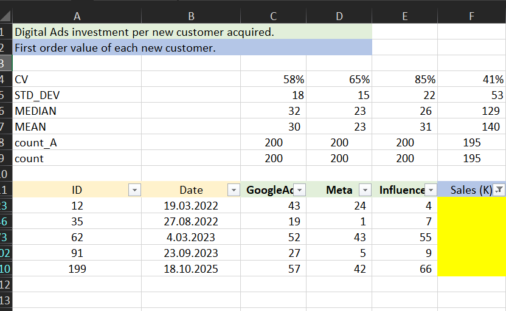
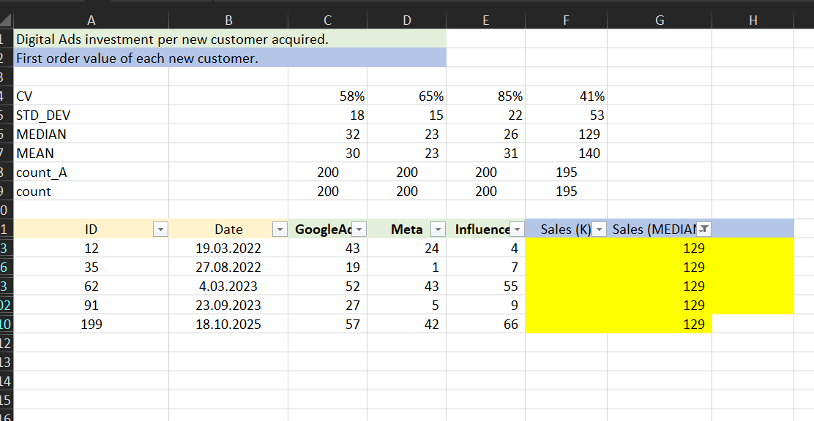
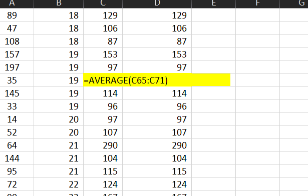
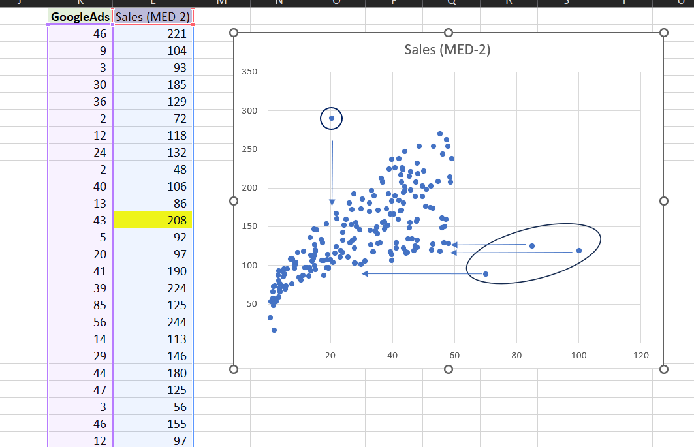
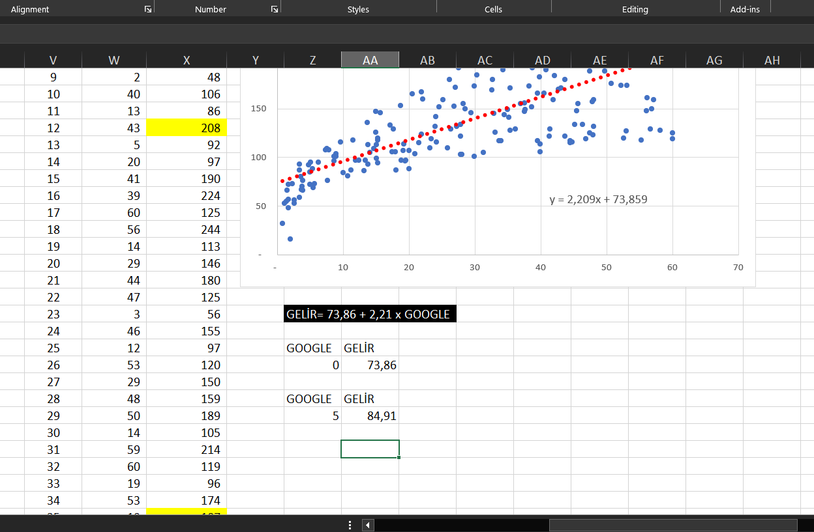
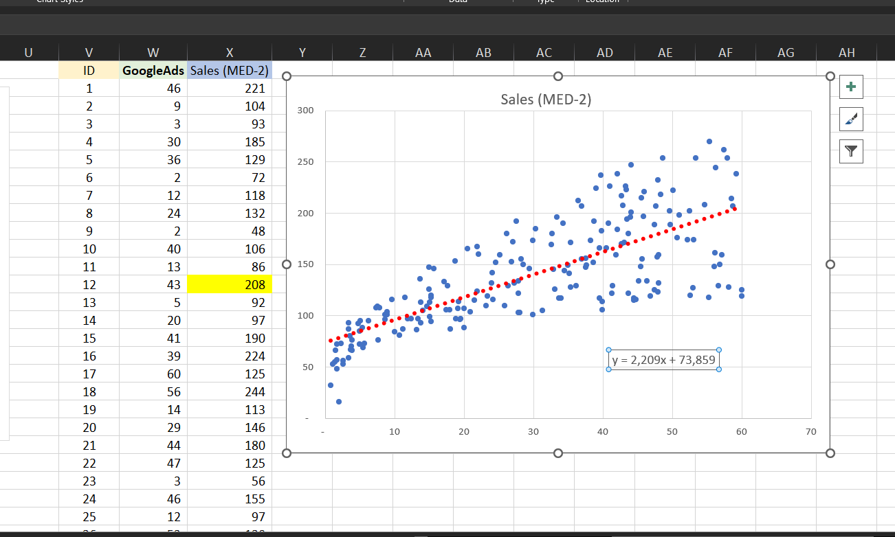

# 📊 Dijital Reklam Yatırımı Analizi (Excel Projesi)

Bu proje, dijital reklam harcamalarının satışlara etkisini analiz etmek amacıyla Excel kullanılarak hazırlanmıştır. Google Ads, Meta ve Influencer kampanyalarına yapılan yatırımların verimliliği; istatistiksel analizler, eksik veri tamamlamaları, scatter plot görselleştirmeleri ve doğrusal regresyon modelleri aracılığıyla değerlendirilmiştir.

---

## 🎯 Proje Hedefleri
- Farklı reklam kanallarındaki harcama verilerini analiz etmek
- Satış verilerindeki eksik veya uç değerleri belirleyip uygun yöntemlerle düzeltmek
- Görsel analizlerle eğilimleri ve aykırı değerleri ortaya çıkarmak
- Regresyon analiziyle satış tahmininde bulunmak

---

## 📁 Proje Dosyaları
- `DigitalAdsPlus_01RUN01.xlsx` – Ana veri dosyası
- `images/` – Grafik ve ekran görüntülerini içeren klasör

---

## 📊 İstatistiksel Özet



Her reklam kanalı (Google Ads, Meta, Influencer) için aşağıdaki ölçümler hesaplandı:

- **CV (Varyasyon Katsayısı):** En yüksek CV Influencer kanalında (%85), bu da dalgalı bir harcama yapısını işaret ediyor.
- **Standart Sapma (STD_DEV):** Influencer kanalında sapma en yüksek (22), verinin tutarsız olduğunu gösteriyor.
- **Medyan & Ortalama:** Satışlardaki merkezi eğilimleri anlamada kullanıldı.
- **Veri Sayısı (Count):** Her kanal için 200 veri noktası üzerinden analiz yapıldı.

---

## 🧹 Veri Temizleme ve Eksik Değer Doldurma

### Medyan Kullanılarak Tamamlama



Satış verilerindeki eksik alanlar, global **medyan (129)** değeriyle dolduruldu. Bu yöntem, aşırı uç verilerin etkisini azaltır.

### Komşu Ortalama Kullanımı



Daha doğal bir tahmin için, eksik verilerin çevresindeki satırlardan alınan ortalamalar (`=AVERAGE()`) ile doldurma işlemi uygulandı.

---

## 📈 Scatter Plot ve Aykırı Değerler

### Google Ads - Sales Korelasyonu



Google Ads harcamaları ile satışlar arasındaki ilişki scatter plot ile gösterildi. Genel olarak **pozitif korelasyon** görülmektedir.

### Aykırı Değer İşaretleme



- 🔵 **Yüksek satış – düşük harcama:** Viral etki olabilir.
- 🔴 **Yüksek harcama – düşük satış:** Etkisiz reklam kullanımı.

---

## 📐 Regresyon Analizi

### Doğrusal Model



Scatter plot üzerine çizilen doğrusal trendline ile aşağıdaki tahmin modeli oluşturulmuştur:

```
Sales = 2.209 * GoogleAds + 73.86
```

Bu denklemle reklam bütçenize göre satış tahmininde bulunabilirsiniz.

#### Örnek Hesaplamalar:
- Google Ads = 0 → Tahmini Satış = **73.86K**
- Google Ads = 5 → Tahmini Satış = **84.91K**

---

## 📌 Öne Çıkan Sonuçlar
- Influencer kanalında çok değişken harcama yapıldığı tespit edildi.
- Eksik veriler medyan ve yerel ortalama ile tamamlandı.
- Regresyon analizi, satışların %70’e kadar Google Ads ile açıklanabildiğini gösterdi.
- Aykırı değerler kampanya optimizasyonu için fırsat sağladı.

---

## 👤 Hakkımda

Ben Türkiye'den bir veri analisti adayıyım. Excel, SQL, Power BI ve Python üzerine çalışıyorum. Bu proje, dijital pazarlama verilerini analiz ederek içgörü çıkarma yeteneğimi geliştirmek adına önemli bir adımdı.

---
